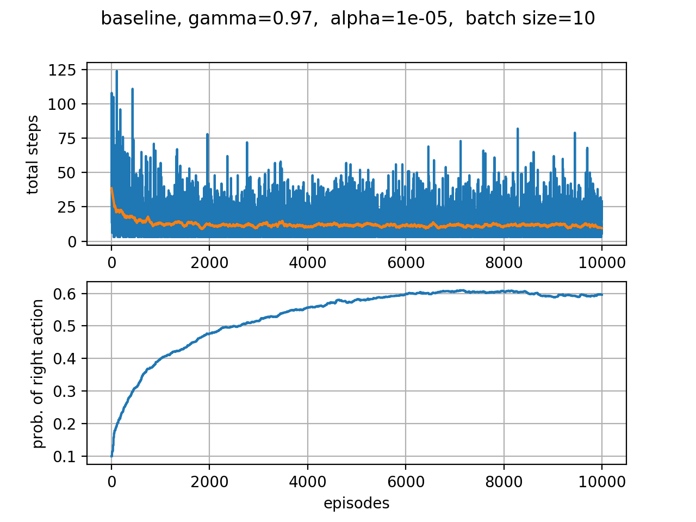

# Short Corridor Problem

The short corridor problem is an example given in *Sutton, Barto: Introduction to Reinforcement Learning*. It is solved using a vanilla policy gradient algorithm and a policy gradient algorithm with baseline.

- PDF: http://incompleteideas.net/book/the-book.html

## Requirements

- numpy: https://www.numpy.org/
- matplotlib: https://matplotlib.org/
- scipy: https://www.scipy.org/

## The model

The underlying action space *A*={left, right} is described by a random variable *a*=0,1. The policy is parametrised by the Bernoulli distribution

In this parametrisation, the parameter *θ*∈(0,1) is equivalent to the probability *p* of choosing *a*=1. Given a batch of trajectories, the basic update rule for the parameter is given by  

The update rule with baseline is given by

where the estimate of the state value function was chosen to be a single number.

## Results

Expected:  
probability ≈ 0.59  
mean reward ≈ -11.6 

o-o-o-o-o-o-o-o-o-o-o-o-o-o-o-o-o-o-o-o-o-o-o-o-o-o

  Agent:			baseline  
  Initial Probability:		0.1  
  Discount Factor:		0.97  
  Batch Size:			10 
  Number of Episodes:		10000  
  Learning Rate:		1e-05  
  final mean probability:	0.593163247413098  
  final mean reward:		-11.292  

o-o-o-o-o-o-o-o-o-o-o-o-o-o-o-o-o-o-o-o-o-o-o-o-o-o

The total amount of steps for each sampled trajectory is shown in blue in the upper panel. The orange line indicates the mean reward averaged with help of the *Savitzky-Golay-Filter*. The lower diagram shows the convergence of the randomly initialised probability to the expected value *p* = 0.59.

