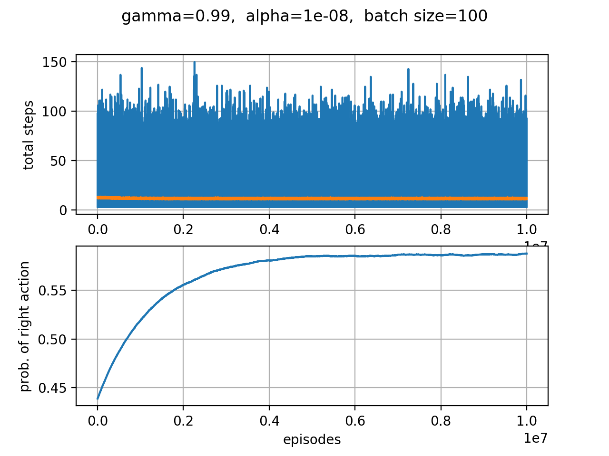

# Short Corridor Problem

The short corridor problem is an example given in *Sutton, Barto: Introduction to Reinforcement Learning*. It is solved using a vanilla policy gradient algorithm.

- PDF: http://incompleteideas.net/book/the-book.html

## Requirements

- numpy: https://www.numpy.org/
- matplotlib: https://matplotlib.org/
- scipy: https://www.scipy.org/

## The model

The underlying action space *A*={left, right} is described by a random variable *a*=0,1. The policy is parametrised by the Bernoulli distribution

In this parametrisation, the parameter *θ*∈(0,1) is equivalent to the probability *p* of choosing *a*=1. Given a batch of trajectories, the update rule for the parameter is given by  

## Results

Expected:  
final probability  ≈ 0.59  
mean reward &ensp;&ensp;≈ -11.6 

o-o-o-o-o-o-o-o-o-o-o-o-o-o-o-o-o-o-o-o-o-o-o-o-o-o

  Initial Probability:	0.9577937722464945  
  Discount Factor:	0.99  
  Batch Size:		100  
  Number of Episodes:	100000  
  Learning Rate:		5e-07  
  final mean probability:	0.5916856578457504  
  final mean reward:	-11.6388  

o-o-o-o-o-o-o-o-o-o-o-o-o-o-o-o-o-o-o-o-o-o-o-o-o-o

The total amount of steps for each sampled trajectory is shown in blue in the upper panel. The orange line indicates the mean reward averaged with help of the *Savitzky-Golay-Filter*. The lower diagram shows the convergence of the randomly initialized probability to the expected value *p* = 0.59.

